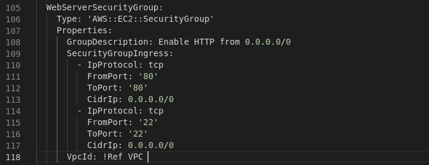

# Desafio AWS

As questões abaixo devem ser respondidas no arquivo [RESPOSTAS-AWS.md](RESPOSTAS-AWS.md) em um fork desse repositório. Algumas questões necessitam de evidências visuais. Nesses casos, um snapshot da tela com o resultado esperado é o suficiente.
Nas demais questões, o formato é livre. Quanto mais sucinto e direto, melhor.
Envie o endereço do seu repositório para desafio@getupcloud.com.


# Desafio AWS

## 1 - Setup de ambiente

Execute os mesmos passos de criação de ambiente descritos anteriormente, ***porém atenção:*** dessa vez utilize o arquivo "formandodevops-desafio-aws.json"

```
export STACK_FILE="file://formandodevops-desafio-aws.json"
aws cloudformation create-stack --region us-east-1 --template-body "$STACK_FILE" --stack-name "$STACK_NAME" --no-cli-pager
aws cloudformation wait stack-create-complete --stack-name "$STACK_NAME"
```


## 2 - Networking

A página web dessa vez não está sendo exibida corretamente. Verifique as **configurações de rede** que estão impedindo seu funcionamento.

Analisando as configurações foi identificado que a regra de inbound do security group está errada, conforme imagem:


Segundo passo foi identicar o trecho de código que estava com as configurações erradas e corrigir:


Arquivo depois da modificação:


Depois das modificações, foi feito update da stack, com o comando abaixo

```bash
aws cloudformation update-stack --template-body "$STACK_FILE" --stack-name "$STACK_NAME" --no-cli-pager
```

Feito o teste novamente, e a página foi exibida corretamente:


## 3 - EC2 Access

Para acessar a EC2 por SSH, você precisa de uma *key pair*, que **não está disponível**. Pesquise como alterar a key pair de uma EC2.

Após trocar a key pair

1 - acesse a EC2:
```
ssh -i [sua-key-pair] ec2-user@[ip-ec2]
```

2 - Altere o texto da página web exibida, colocando seu nome no início do texto do arquivo ***"/var/www/html/index.html"***.

Para esse desafio foi necessário adicionar liberação de conexão na porta 22 (ssh), e atualizar a stack com o comando _aws cloudformation update-stack_ (citado na questão anterior):



Em seguida foi gerada uma chave ssh do tipo _rsa_, extraída a chave pública através do comando _ssh-keygen -y -f "<diretorio>/<arquivo>.pem_" e adicionado ao arquivo _.ssh/authorized_keys da instância.

Realizado o teste de acesso via ssh:


Em seguida foi elevado o nivel do usuário para root e executado o comando:

```bash
echo "<html><body><h1>Roberto Santos - Formando DevOps - EC2 Rodando na Region: ${AWS::Region}<h1></body></html>" > /var/www/html/index.html 
```
Teste de acesso depois da atualização:


## 4 - EC2 troubleshooting

No último procedimento, A EC2 precisou ser desligada e após isso o serviço responsável pela página web não iniciou. Encontre o problema e realize as devidas alterações para que esse **serviço inicie automaticamente durante o boot** da EC2.

Após simulação de reboot da instância, foi identificado que o serviço httpd, não estava habilitado para inicialização automática.


Foi feita a configuração do serviço com o comando:
```bash
systemctl enable httpd && systemctl start httpd
```

## 5 - Balanceamento

Crie uma cópia idêntica de sua EC2 e inicie essa segunda EC2. Após isso, crie um balanceador, configure ambas EC2 nesse balancedor e garanta que, **mesmo com uma das EC2 desligada, o usuário final conseguirá acessar a página web.**

Para a criação da segunda instância, foi copiado o código da primeira instância e alterado o nome do recurso:


## 6 - Segurança

Garanta que o acesso para suas EC2 ocorra somente através do balanceador, ou seja, chamadas HTTP diretamente realizadas da sua máquina para o EC2 deverão ser barradas. Elas **só aceitarão chamadas do balanceador** e esse, por sua vez, aceitará conexões externas normalmente.
