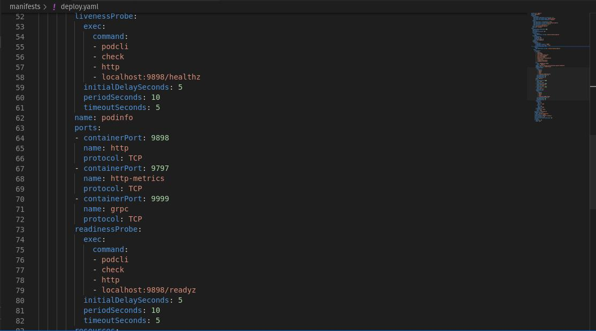
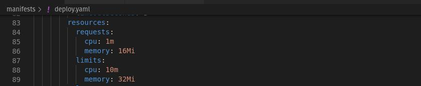

## 1. Gitlab

```
  -> pipeline com build da imagem do app
     -> [plus] linter do Dockerfile (tip: use o https://github.com/hadolint/hadolint)
        -> falhar se houver severidade >= Warning
  -> [plus] scan da imagem usando Trivy (https://github.com/aquasecurity/trivy) standalone (binário)
     -> falhar se houver bug crítico
```

O arquivo de configuração do pipeline esta no repositorio [podinfo](/podinfo/.gitlab-ci.yml).

### Evidências:

#### Linter do Dokerfile


#### Scan com Trivy


#### Pipeline


## 2. Terraform

```
  -> criar cluster kind
  -> [plus] criar repo no gitlab
```

Os arquivos estão no diretório [Terraform](/terraform/)

### Evidências:

#### Plan do Cluster Kind


#### Cluster Criado


#### Plan do Repo


#### Repo Criado


## 3. Kubernetes

```
  -> implementar no app
     -> probes liveness e readiness
     -> definir resource de cpu e memória
  -> [plus] escalar app com base na métrica `requests_total`
     -> escalar quando observar > 2 req/seg.
  -> [plus] instalar app com fluxcd
```


### Evidências:

#### Liveness e Readiness


#### Limits


Durante a configuração do cluster fiz o deploy do **ArgoCD** e outras features com o local-exec, e ja fiz a configuração do CD:

```bash
      kubectl create ns argocd
      kubectl apply -n argocd -f https://raw.githubusercontent.com/argoproj/argo-cd/v2.4.16/manifests install.
      kubectl apply -f https://gitlab.com/rbsantosbr/gitops/-/raw/main/application.yaml
```


Os manifestos da aplicação estão no Diretório [Gitops](gitops/)

Não consegui validar o HorizontalPodAutoscaling - hpa

      
