## 1. Gitlab

```
  -> pipeline com build da imagem do app
     -> [plus] linter do Dockerfile (tip: use o https://github.com/hadolint/hadolint)
        -> falhar se houver severidade >= Warning
  -> [plus] scan da imagem usando Trivy (https://github.com/aquasecurity/trivy) standalone (binário)
     -> falhar se houver bug crítico
```

O arquivo de configuração do pipeline esta no repositorio [podinfo](podinfo/.gitlab-ci.yml).

### Evidências:

#### Linter do Dokerfile
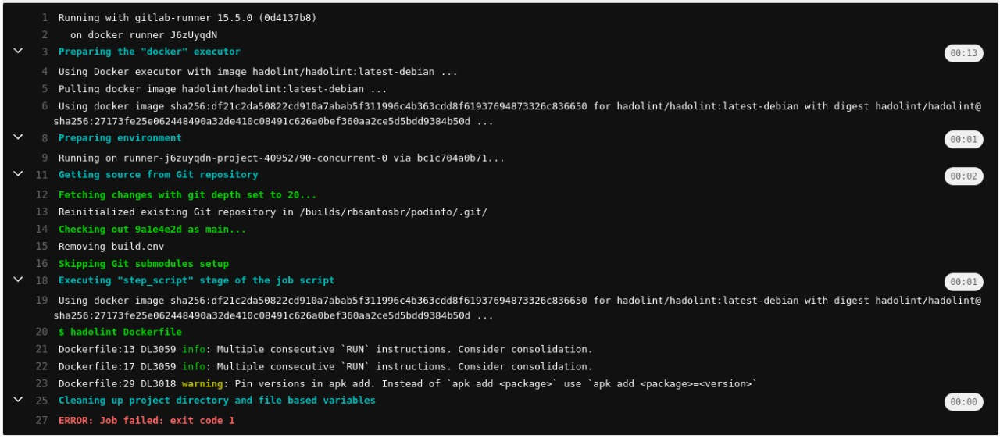


#### Scan com Trivy
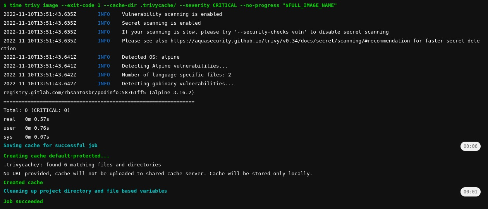

#### Pipeline
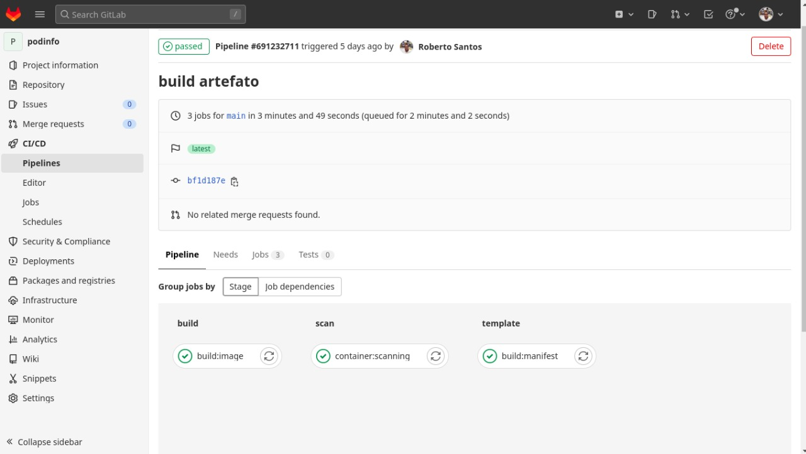


## 2. Terraform

```
  -> criar cluster kind
  -> [plus] criar repo no gitlab
```

Os arquivos estão no diretório [Terraform](terraform/)

### Evidências:

#### Plan do Cluster Kind
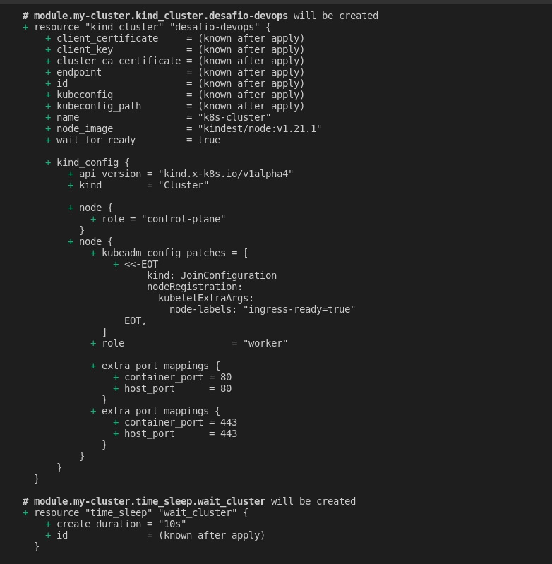

#### Cluster Criado
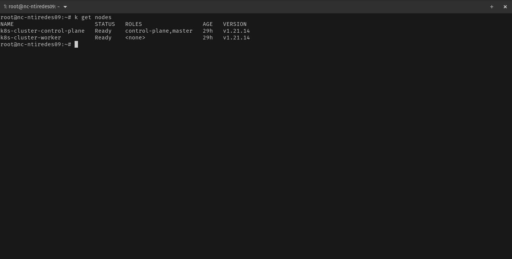

#### Plan do Repo podinfo
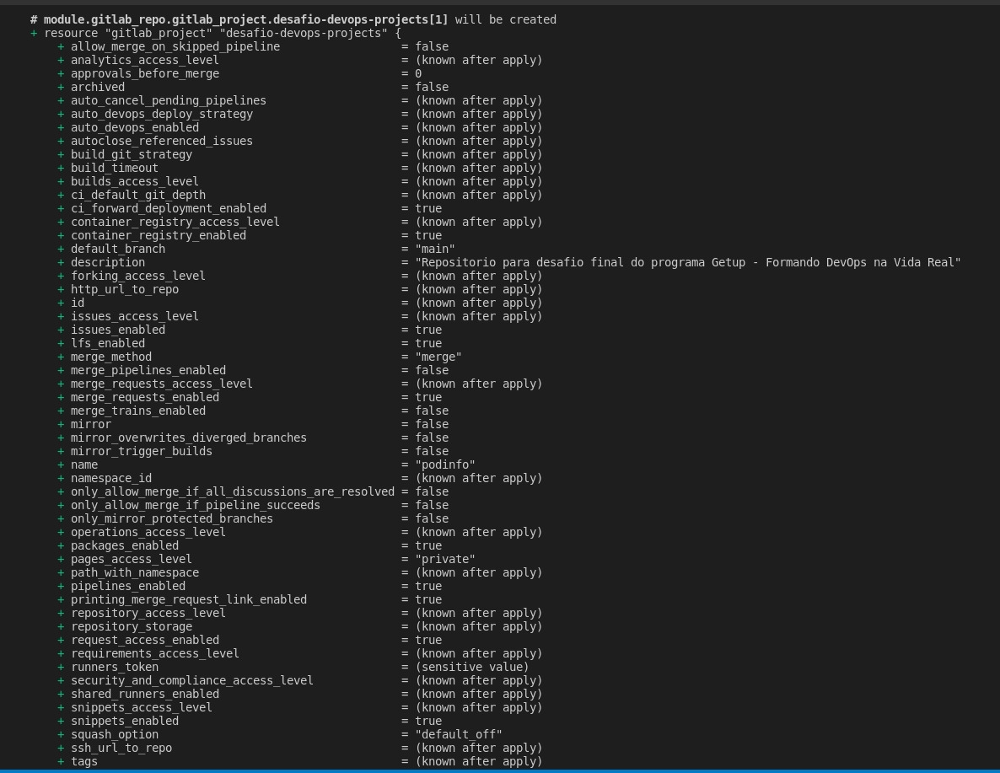

#### Repo podinfo Criado
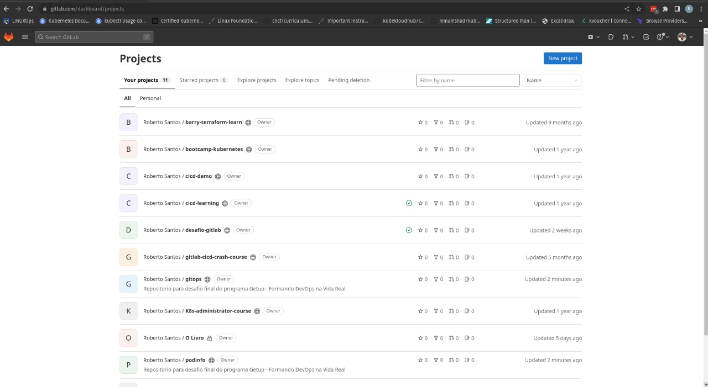


## 3. Kubernetes

```
  -> implementar no app
     -> probes liveness e readiness
     -> definir resource de cpu e memória
  -> [plus] escalar app com base na métrica `requests_total`
     -> escalar quando observar > 2 req/seg.
  -> [plus] instalar app com fluxcd
```


### Evidências:

#### Liveness e Readiness

```yaml
livenessProbe:
          exec:
            command:
            - podcli
            - check
            - http
            - localhost:9898/healthz
          initialDelaySeconds: 5
          periodSeconds: 10
          timeoutSeconds: 5
        name: podinfo
        ports:
        - containerPort: 9898
          name: http
          protocol: TCP
        - containerPort: 9797
          name: http-metrics
          protocol: TCP
        - containerPort: 9999
          name: grpc
          protocol: TCP
        readinessProbe:
          exec:
            command:
            - podcli
            - check
            - http
            - localhost:9898/readyz
          initialDelaySeconds: 5
          periodSeconds: 10
          timeoutSeconds: 5
```

#### Limits
```yaml
resources:
          requests:
            cpu: 1m
            memory: 16Mi
          limits:
            cpu: 10m
            memory: 32Mi
```

Durante a configuração do cluster fiz o deploy do **ArgoCD** e outras features com o local-exec, e ja fiz a configuração do CD:

```yaml
      kubectl create ns argocd
      kubectl apply -n argocd -f https://raw.githubusercontent.com/argoproj/argo-cd/v2.4.16/manifests install.
      kubectl apply -f https://gitlab.com/rbsantosbr/gitops/-/raw/main/application.yaml
```

#### Interface do ArgoCD

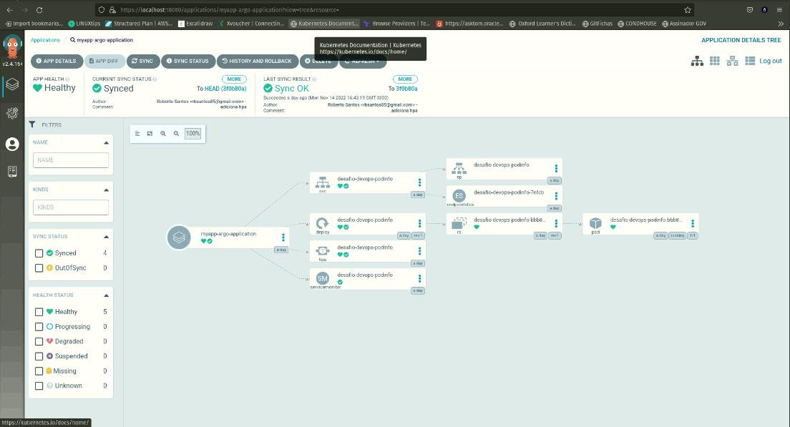


Os manifestos da aplicação estão no Diretório [Gitops](gitops/)

Não consegui validar o HorizontalPodAutoscaling - hpa


## 4. Observabilidade

```
  -> prometheus stack (prometheus, grafana, alertmanager)
  -> retenção de métricas 3 dias
     -> storage local (disco), persistente
  -> enviar alertas para um canal no telegram
  -> logs centralizados (loki, no mesmo grafana do monitoramento)
  -> [plus] monitorar métricas do app `request_duration_seconds`
     -> alertar quando observar > 3 seg.
  -> [plus] tracing (Open Telemetry)
```
### Deploy
```
helm install prometheus-stack prometheus-community/kube-prometheus-stack --version 41.7.4 --namespace monitoring --create-namespace
helm install loki grafana/loki-stack --version 2.8.4 --namespace=loki --create-namespace
```

Para configuração do tempo de retenção, editei o StateFulset do prometheus e alterei o parâmetro **--storage.tsdb.retention.time=3d**

Para criação do volume persistente utilizei as configurações de storage do prometheus que utiliza um storageClass e este por sua vez é automaticamente configurado pelo StatefulSet:

```yaml
apiVersion: monitoring.coreos.com/v1
kind: Prometheus
metadata:
  name: prometheus-stack-storage-persisted
spec:
  storage:
    volumeClaimTemplate:
      spec:
        storageClassName: standard
        resources:
          requests:
            storage: 10Gi
```

Para validarmos a criação, utilizei o comando **kubectl get pv**:

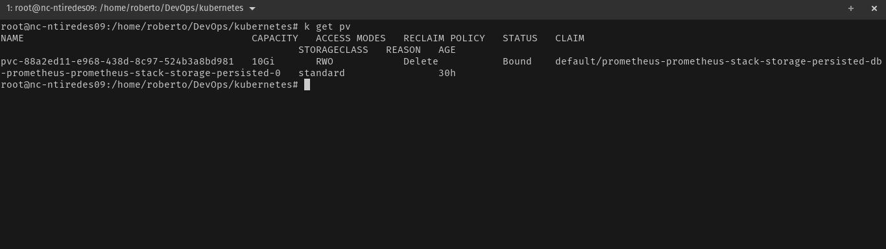


Para configuração dos alertas utilizei o [AlertmanagerConfig](observabilidade/alertManagerConfig.yaml) em seguida editei o **AlertManager** para utilizar as configurações:

```yaml
alertmanagerConfigSelector:
    matchLabels:
      alertmanagerConfig: desafio-devops
```

Não consegui validar o envio de mensagens para o grupo.

Para configuração dos logs centralizados fiz a configuração do DataSource loki na interface do grafana, adicionando a URL: http://loki.loki:3100

#### Loki logs
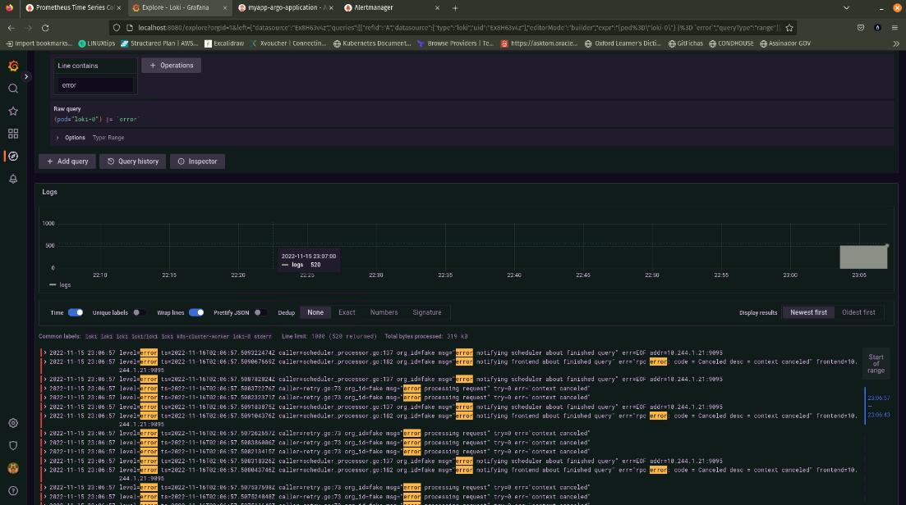

Para monitorar as métricas do app, fiz a configuração do exporter/ target, bem como criação do serviceMonitor, mas não conclui a configuração no alertManager, nem do tracing.

#### Prometheus Target
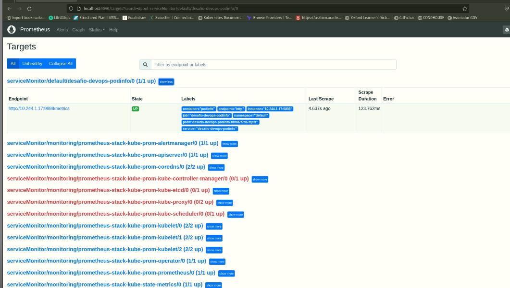

