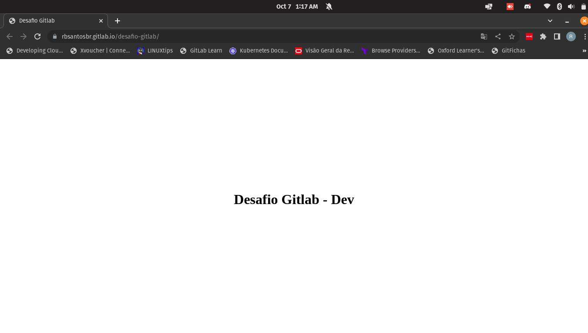
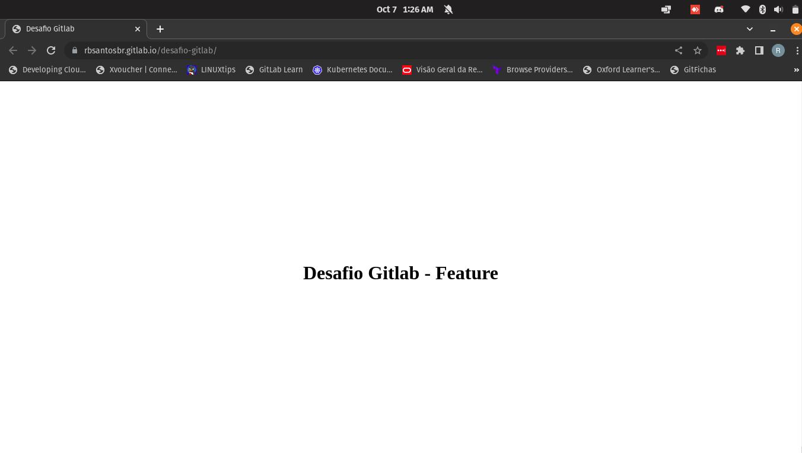
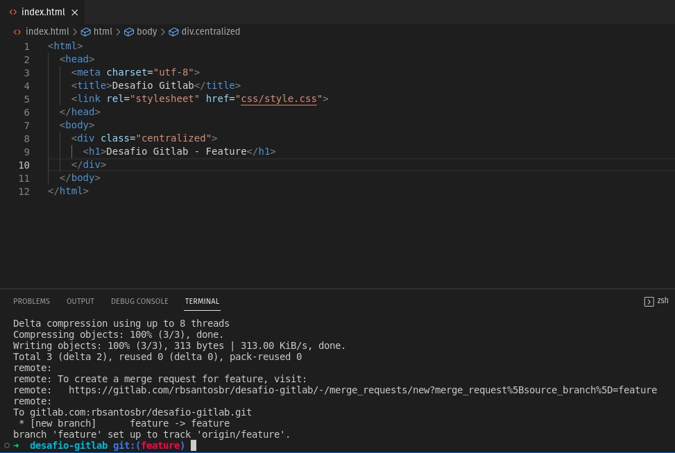
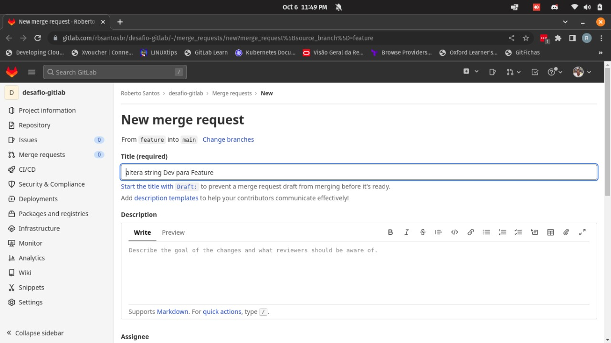
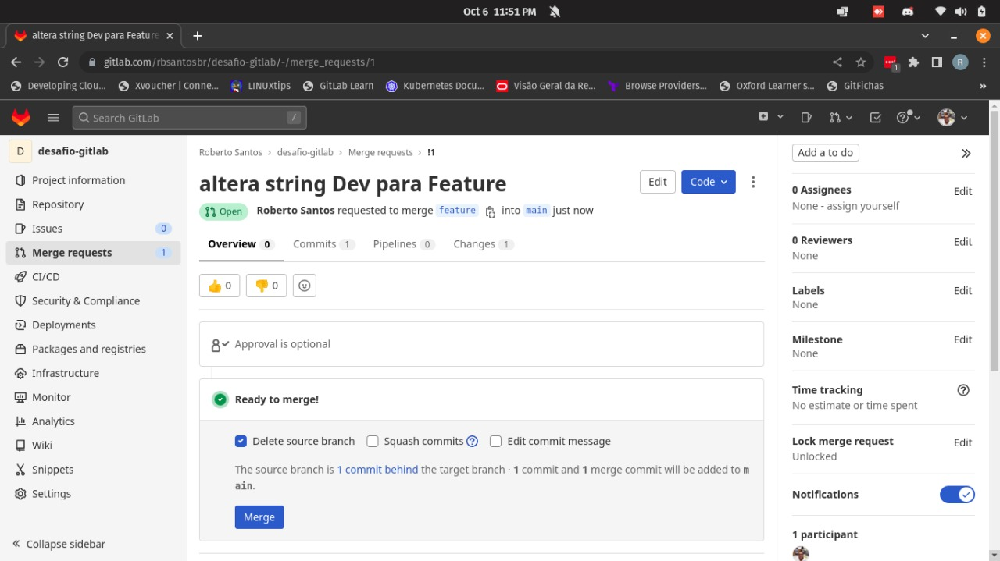
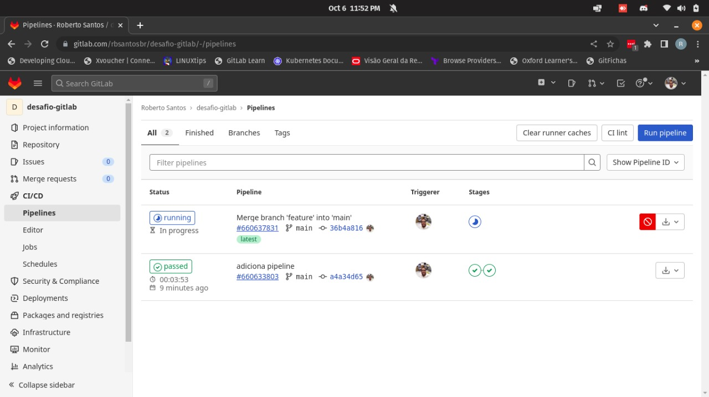

# Desafio GitLab - Respostas

### Link do repositorio:

1. https://gitlab.com/rbsantosbr/desafio-gitlab

### Git Log:

```
commit 40400ce931378cd7a3cb2d900fa6d645bf9962a5
Merge: ae46ef0 a439cc0
Author: Roberto Santos <rbsantos85@gmail.com>
Date:   Fri Oct 7 01:18:52 2022 -0300

    Merge branch 'feature'

commit ae46ef092ad7cfb10e8c9a90b68da50c63fe044d
Author: Roberto Santos <rbsantos85@gmail.com>
Date:   Fri Oct 7 01:10:49 2022 -0300

    Adiciona pipeline de CI/CD

commit a439cc01ae3e47dc01a07094dec986fbba2a4ad4
Author: Roberto Santos <rbsantos85@gmail.com>
Date:   Fri Oct 7 01:08:31 2022 -0300

    Altera string Dev para Feature

commit f748af253a527fb8f5bc861de70a505f2634137f
Author: Roberto Santos <rbsantos85@gmail.com>
Date:   Fri Oct 7 01:06:54 2022 -0300

    Adiciona string Dev

commit a165b8f5458681327337bcd54317e082bd9e6b7d
Author: Roberto Santos <rbsantos85@gmail.com>
Date:   Fri Oct 7 00:58:57 2022 -0300

    Initial Commit
```

### Evidencias:

**1. DEV:**



**2. FEATURE:**


### Informações Adicionais

1. O stage **test** foi adicionado na criação da pipeline para a simulação do recurso _stages_ e suas dependências (_needs_), visto que o lint do arquivo **.gitlab-ci.yml** já é aplicado por default;

2. Simulando um cenário real, em outro momento fiz um push da branch _feature_ para uma branch com mesmo nome no repositório remoto, criei um Merge Request, realizei a aprovação e ,por fim, o merge.
Seguem evidências:


  


  


  





